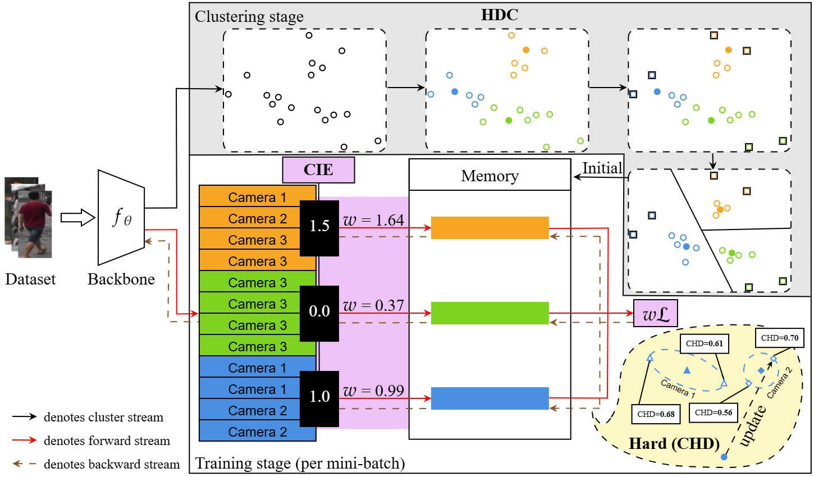
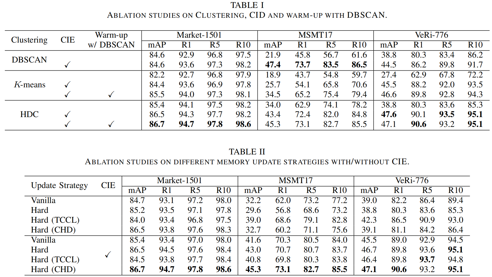

# 3C: Confidence-Guided Clustering and Contrastive Learning for Unsupervised Person Re-Identification

The *official* repository for [3C: Confidence-Guided Clustering and Contrastive Learning for Unsupervised Person Re-Identification](https://arxiv.org/abs/2408.09464). We achieve state-of-the-art results: 86.7%/94.7%, 45.3%/73.1% and 47.1%/90.6% in terms of mAP/Rank-1 accuracy on Market-1501, the complex datasets MSMT17 and VeRi-776, respectively.


## Requirements

### Installation

```shell
git clone https://github.com/stone5265/3C-reid.git
cd 3C-reid
pip install requirements.txt
python setup.py build_ext --inplace
python setup.py install
```

### Prepare Datasets

```shell
mkdir $HOME/Dataset
```
Download the person datasets [Market-1501](https://drive.google.com/file/d/0B8-rUzbwVRk0c054eEozWG9COHM/view), [MSMT17](https://arxiv.org/abs/1711.08565), and the vehicle datasets [VeRi-776](https://vehiclereid.github.io/VeRi/).
Then unzip them under the directory like
```shell
$HOME/Dataset
├── Market-1501-v15.09.15
│   ├── bounding_box_test
│   ├── bounding_box_train
│   ├── query
│   └── ...
├── MSMT17_V1
│   ├── bounding_box_test
│   ├── bounding_box_train
│   ├── query
│   └── ...
└── VeRi
    ├── bounding_box_test
    ├── bounding_box_train
    ├── query
    └── ...
```

## Training

We utilize 2 RTX-3090 GPUs for training. For more parameter configuration, please check `run_code.sh` and `CCC/configs/config.py`.

**examples:**

Market-1501:

1. Using HDC:
```shell
CUDA_VISIBLE_DEVICES=0,1 python CCC/main.py  --dataset market1501 --height 256 --width 128 \
--num-clusters 750 --iters 200 --num-epochs 60 --warmup-iters 10 \
--warmup-with-dbscan --dbscan-eps 0.6 \
--arch resnet50 --resnet-pretrained V1 --pooling-type gem \
--hdc-outlier --hdc-centroids --hdc-init k-means++2 \
--cm-mode hd_camera --loss-with-camera \
--root-dir $HOME/Dataset --log-dir logs/log
```

2. Using DBSCAN:
```shell
CUDA_VISIBLE_DEVICES=0,1 python CCC/main_dbscan.py  --dataset market1501 --height 256 --width 128 \
--iters 200 --num-epochs 60 --warmup-iters 10 \
--dbscan-eps 0.6 \
--arch resnet50 --resnet-pretrained V1 --pooling-type gem \
--cm-mode hd_camera --loss-with-camera \
--root-dir $HOME/Dataset --log-dir logs/log_dbscan
```

3. Using K-means:
```shell
CUDA_VISIBLE_DEVICES=0,1 python CCC/main_kmeans.py  --dataset market1501 --height 256 --width 128 \
--num-clusters 750 --iters 200 --num-epochs 60 --warmup-iters 10 \
--warmup-with-dbscan --dbscan-eps 0.6 \
--arch resnet50 --resnet-pretrained V1 --pooling-type gem \
--cm-mode hd_camera --loss-with-camera \
--root-dir $HOME/Dataset --log-dir logs/log_kmeans
```

MSMT17:

1. Using HDC:
```shell
CUDA_VISIBLE_DEVICES=0,1 python CCC/main.py  --dataset msmt17 --height 256 --width 128 \
--num-clusters 1000 --iters 400 --num-epochs 60 --warmup-iters 10 \
--warmup-with-dbscan --dbscan-eps 0.6 \
--arch resnet50 --resnet-pretrained V1 --pooling-type gem \
--hdc-outlier --hdc-centroids --hdc-init k-means++2 \
--cm-mode hd_camera --loss-with-camera \
--root-dir $HOME/Dataset --log-dir logs/log
```

2. Using DBSCAN:
```shell
CUDA_VISIBLE_DEVICES=0,1 python CCC/main_dbscan.py  --dataset msmt17 --height 256 --width 128 \
--iters 400 --num-epochs 60 --warmup-iters 10 \
--dbscan-eps 0.6 \
--arch resnet50 --resnet-pretrained V1 --pooling-type gem \
--cm-mode hd_camera --loss-with-camera \
--root-dir $HOME/Dataset --log-dir logs/log_dbscan
```

3. Using K-means:
```shell
CUDA_VISIBLE_DEVICES=0,1 python CCC/main_kmeans.py  --dataset msmt17 --height 256 --width 128 \
--num-clusters 1000 --iters 400 --num-epochs 60 --warmup-iters 10 \
--warmup-with-dbscan --dbscan-eps 0.6 \
--arch resnet50 --resnet-pretrained V1 --pooling-type gem \
--cm-mode hd_camera --loss-with-camera \
--root-dir $HOME/Dataset --log-dir logs/log_kmeans
```

VeRi-776:

1. Using HDC:
```shell
CUDA_VISIBLE_DEVICES=0,1 python CCC/main.py  --dataset veri --height 224 --width 224 \
--num-clusters 1000 --iters 400 --num-epochs 60 --warmup-iters 10 \
--warmup-with-dbscan --dbscan-eps 0.6 \
--arch resnet50 --resnet-pretrained V1 --pooling-type gem \
--hdc-outlier --hdc-centroids --hdc-init k-means++2 \
--cm-mode hd_camera --loss-with-camera \
--root-dir $HOME/Dataset --log-dir logs/log
```

2. Using DBSCAN:
```shell
CUDA_VISIBLE_DEVICES=0,1 python CCC/main_dbscan.py  --dataset veri --height 224 --width 224 \
--iters 400 --num-epochs 60 --warmup-iters 10 \
--dbscan-eps 0.6 \
--arch resnet50 --resnet-pretrained V1 --pooling-type gem \
--cm-mode hd_camera --loss-with-camera \
--root-dir $HOME/Dataset --log-dir logs/log_dbscan
```

3. Using K-means:
```shell
CUDA_VISIBLE_DEVICES=0,1 python CCC/main_kmeans.py  --dataset veri --height 224 --width 224 \
--num-clusters 1000 --iters 400 --num-epochs 60 --warmup-iters 10 \
--warmup-with-dbscan --dbscan-eps 0.6 \
--arch resnet50 --resnet-pretrained V1 --pooling-type gem \
--cm-mode hd_camera --loss-with-camera \
--root-dir $HOME/Dataset --log-dir logs/log_kmeans
```

## Results





For more detail experiment setup, please check `experiments/ablation_studies.py` and `experiments/parameter_analysis.py`.

## Citation

If you find this code useful for your research, please cite our paper
```
...
```

# Acknowledgements

Thanks to [SpCL](https://github.com/yxgeee/SpCL) and [ClusterContrast](https://github.com/alibaba/cluster-contrast-reid).